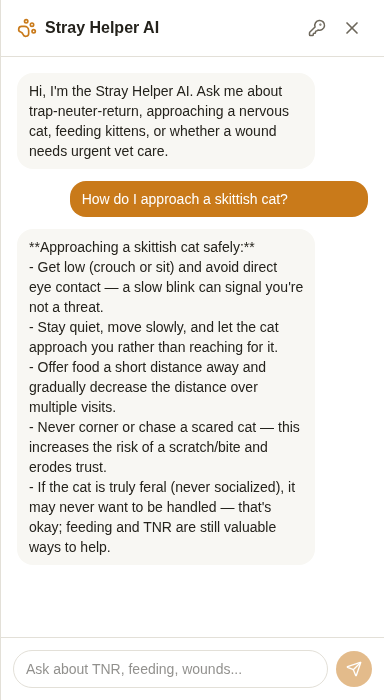
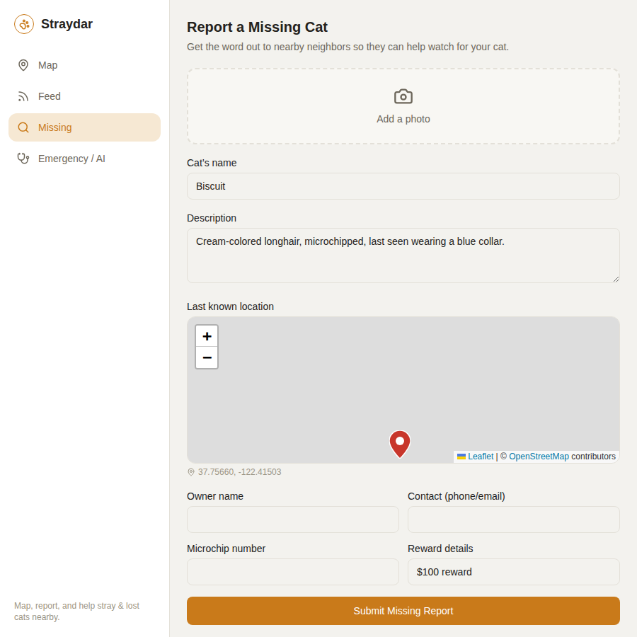

# Straydar

A map-based tool for tracking, reporting, and getting help for stray and lost
cats in a neighborhood — built as a React + Supabase full-stack app.

[](https://github.com/rayS2543/straydar/actions/workflows/ci.yml)


## What it does

Drop a pin, report a cat, and it's shared live with everyone else using the
app — not just saved to your own browser. Straydar handles the parts that
make community pet-tracking actually useful in practice:

- **Duplicate detection** — before creating a new cat record, it checks
  sightings within 150m and scores them against the new report's temperament
  and description, so the same colony cat doesn't get re-added every time
  someone spots it (`src/services/matching.js`).
- **Live shared state** — cats and sightings live in Postgres via Supabase
  and sync in real time across everyone's browser (`src/context/DataContext.jsx`).
- **Lost-cat reports** with owner contact info and a dedicated "missing" flow,
  separate from general stray sightings.
- **An AI assistant** for on-the-spot rescue guidance (TNR, approaching a
  scared cat, kitten feeding, wound triage) that works with or without an
  API key — canned expert guidance by default, live Claude responses if you
  add your own Anthropic key.
- **Nearest emergency vets**, pulled live from OpenStreetMap with a static
  fallback list.

| AI rescue assistant | Missing-cat report |
| --- | --- |
|  |  |

## Stack

React 19, Vite, React Router 7, Tailwind CSS v4, Leaflet/react-leaflet for
the map, Supabase (Postgres + Realtime + Auth-ready), the Anthropic SDK for
the assistant, Vitest for tests, oxlint for linting.

See [`DECISIONS.md`](DECISIONS.md) for the reasoning behind the less obvious
choices (why Supabase, why RLS is permissive for now, why the duplicate
matcher is a hand-rolled score instead of ML, why the AI assistant runs
client-side).

## Running it locally

```bash
npm install
cp .env.example .env   # fill in your Supabase project URL + anon key
npm run dev
```

Full backend setup (creating the Supabase project, running the migrations)
is in [`CLAUDE.md`](CLAUDE.md#backend-setup-supabase).

```bash
npm run lint    # oxlint
npm test        # vitest
npm run build   # production build
```

## Project structure

- `src/context/DataContext.jsx` — the single source of truth for `cats`/
  `sightings`; every component reads and writes through `useData()`.
- `src/services/` — persistence (`db.js`, `supabaseClient.js`), the
  duplicate-matching algorithm (`matching.js`), geo math (`geo.js`), and the
  AI assistant (`aiAssistant.js`).
- `src/pages/` — `MapPage`, `FeedPage`, `MissingPage`, `EmergencyPage`.
- `supabase/migrations/` — the Postgres schema and seed data.

`CLAUDE.md` has the full architecture writeup, including the trickiest
cross-file flow (the duplicate-cat detection pipeline) if you want to dig in
further.
